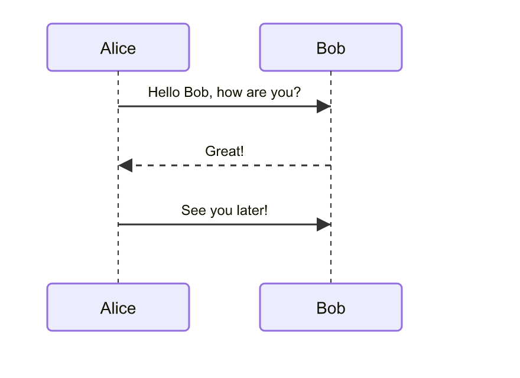
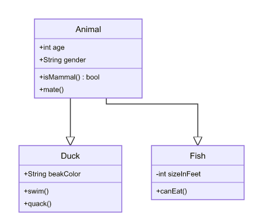
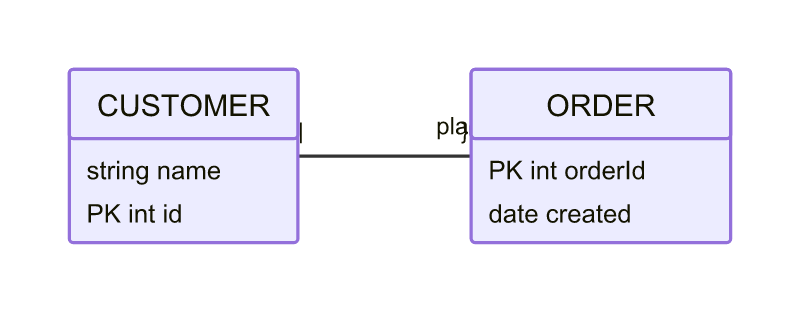
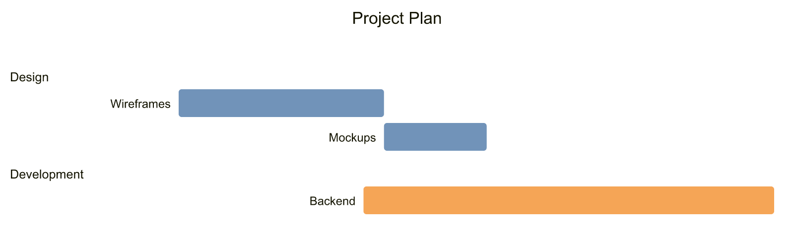
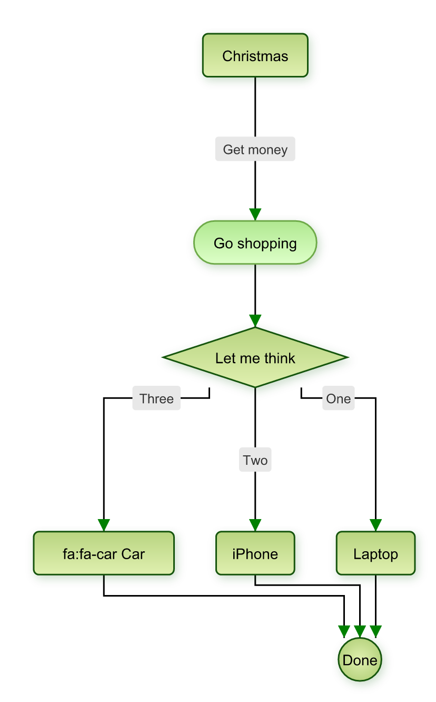
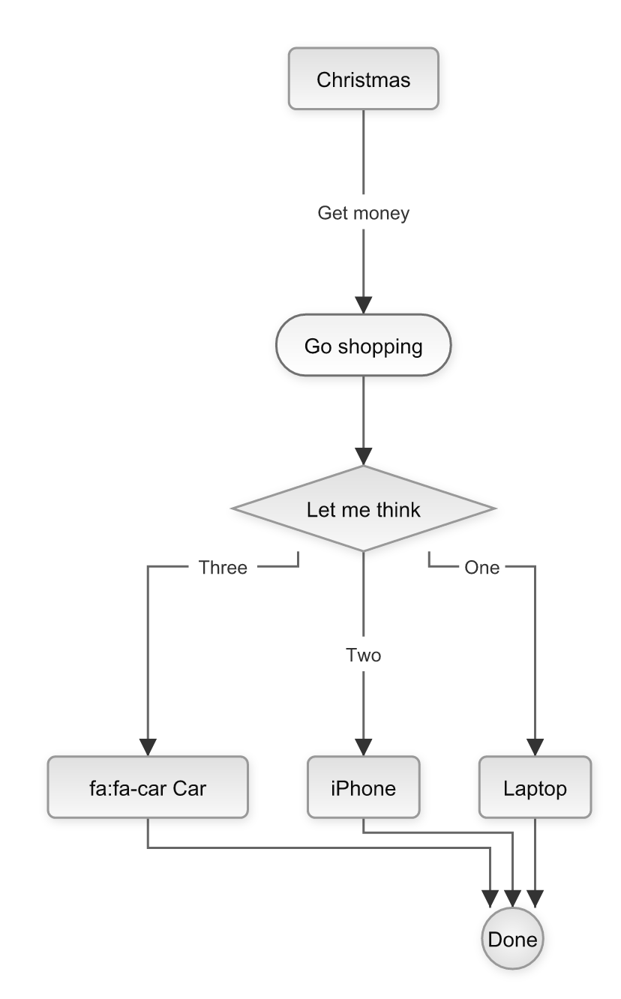

# @speajus/mermaid-to-svg

Mermaid diagrams to SVG strings without a browser. No Puppeteer, no Playwright, no headless Chrome — just Node.js (also works in browser).

## Install

```bash
npm install @speajus/mermaid-to-svg
```

## Quick Start

```typescript
import { renderMermaid } from '@speajus/mermaid-to-svg';

const { svg, bounds } = await renderMermaid(`
  flowchart LR
    A[Start] --> B{Decision}
    B -->|Yes| C[OK]
    B -->|No| D[Cancel]
`);

console.log(svg); // <svg xmlns="...">...</svg>
```

## Themes

Four built-in themes matching mermaid's defaults: `default`, `dark`, `forest`, `neutral`.

```typescript
// Use by name
const { svg } = await renderMermaid(diagram, { theme: 'dark' });

// Or import the theme object
import { darkTheme } from '@speajus/mermaid-to-svg';
const { svg } = await renderMermaid(diagram, { theme: darkTheme });

// Or create a custom theme
import { createTheme } from '@speajus/mermaid-to-svg';
const myTheme = createTheme({
  background: '#1a1a2e',
  primaryColor: '#e94560',
  primaryTextColor: '#ffffff',
});
const { svg } = await renderMermaid(diagram, { theme: myTheme });
```

## API

### `renderMermaid(input, options?)`

Full pipeline: parse → layout → render. Returns `{ svg, bounds, diagramType }`.

```typescript
const result = await renderMermaid(mermaidText, {
  theme: 'dark', // 'default' | 'dark' | 'forest' | 'neutral' | Theme object
  padding: 20, // pixels around the diagram
  idPrefix: 'mermaid', // unique prefix for SVG element IDs
  fontMetrics: provider, // custom FontMetricsProvider for text measurement
  layoutOptions: {}, // ELK layout options override
});
```

### Individual Pipeline Steps

For advanced usage, each step is available separately:

```typescript
import { parse, layout, renderSvg } from '@speajus/mermaid-to-svg';

const ir = await parse(mermaidText); // Mermaid text → IR
const positioned = await layout(ir); // IR → positioned graph
const svg = renderSvg(positioned); // positioned graph → SVG string
```

### Theme Utilities

```typescript
import { createTheme, mergeThemes, defaultTheme } from '@speajus/mermaid-to-svg';

// Create from defaults with overrides
const theme = createTheme({ background: '#111' });

// Merge two themes
const merged = mergeThemes(baseTheme, overrides);
```

## SVG to PNG

Use `@resvg/resvg-js` to convert SVG output to PNG (no browser needed):

```typescript
import { renderMermaid } from '@speajus/mermaid-to-svg';
import { Resvg } from '@resvg/resvg-js';
import { writeFileSync } from 'node:fs';

const { svg, bounds } = await renderMermaid(diagram);
const resvg = new Resvg(svg, {
  fitTo: { mode: 'width', value: bounds.width * 2 },
});
writeFileSync('diagram.png', resvg.render().asPng());
```

## How It Works

```
Mermaid Text → Parser (mermaid) → IR → Layout (ELK.js) → SVG (React renderToStaticMarkup)
```

1. **Parse** — Uses mermaid's internal parser to extract nodes, edges, subgraphs, and direction
2. **Layout** — ELK.js computes positions and edge routing (layered algorithm, orthogonal edges)
3. **Render** — React components produce clean SVG via `renderToStaticMarkup()` — no browser DOM needed

## Diagram Support

### Flowchart

```
flowchart TD
  A[Christmas] -->|Get money| B(Go shopping)
  B --> C{Let me think}
  C -->|One| D[Laptop]
  C -->|Two| E[iPhone]
  C -->|Three| F[fa:fa-car Car]
```


### Sequence

```
sequenceDiagram
  participant Alice
  participant Bob
  Alice->>Bob: Hello Bob, how are you?
  Bob-->>Alice: Great!
  Alice->>Bob: See you later!
```



### Class

```
classDiagram
  class Animal {
    +int age
    +String gender
    +isMammal() bool
  }
  class Duck {
    +String beakColor
    +swim()
  }
  Animal <|-- Duck
```



### State

```
stateDiagram-v2
  [*] --> Idle
  Idle --> Processing : submit
  Processing --> Done : complete
  Processing --> Error : fail
  Error --> Idle : retry
  Done --> [*]
```


### ER (Entity Relationship)

```
erDiagram
  CUSTOMER {
    string name
    int id PK
  }
  ORDER {
    int orderId PK
    date created
  }
  CUSTOMER ||--o{ ORDER : places
```



### Gantt

```
gantt
  title Project Plan
  dateFormat YYYY-MM-DD
  section Design
    Wireframes :a1, 2024-01-01, 10d
    Mockups    :after a1, 5d
  section Development
    Backend    :2024-01-10, 20d
```



### Pie

```
pie title Pets adopted
  "Dogs" : 386
  "Cats" : 85
  "Rats" : 15
```


### Mindmap

```
mindmap
  root((Central))
    Origins
      Long history
      Popularisation
    Research
      On effectiveness
      On adoption
```


### Themes

Four built-in themes — here's the flowchart in each:

| Default                                               | Dark                                               | Forest                                               | Neutral                                               |
| ----------------------------------------------------- | -------------------------------------------------- | ---------------------------------------------------- | ----------------------------------------------------- |
|  |  |  |  |

## Development

```bash
npm test          # Run tests (node:test)
npm run build     # Build with tsup (ESM + CJS + types)
npm run typecheck  # Type check with tsc

# Generate theme sample PNGs
node --import tsx examples/generate-theme-pngs.ts
```

## License

MIT
